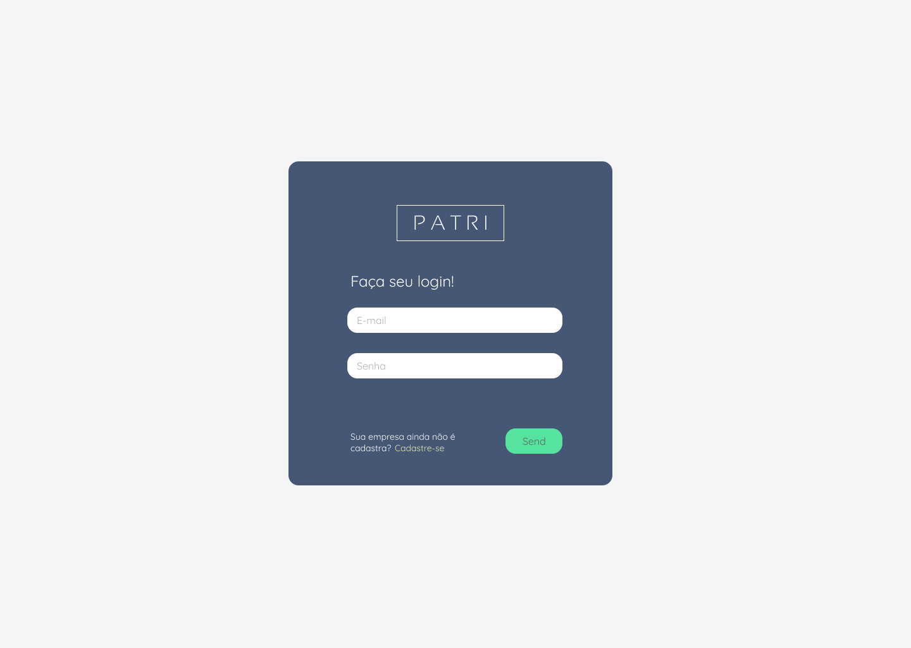
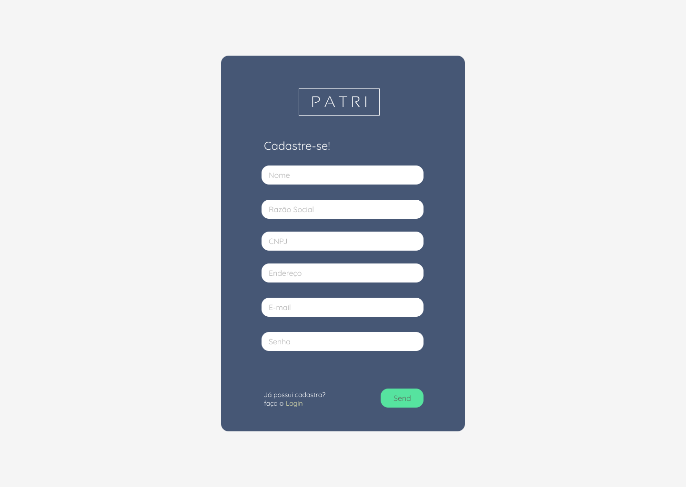
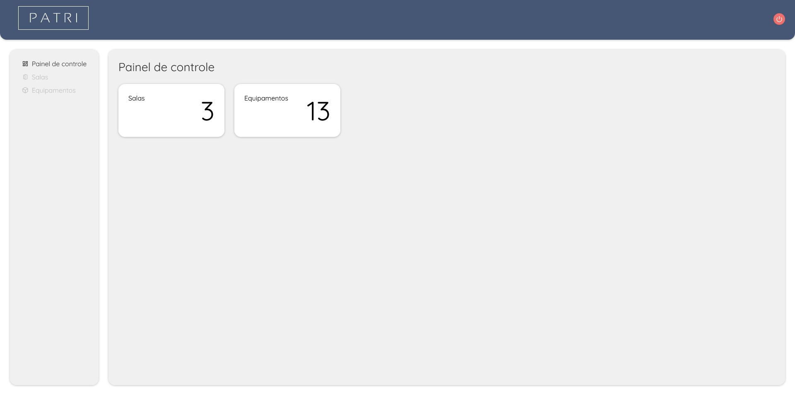
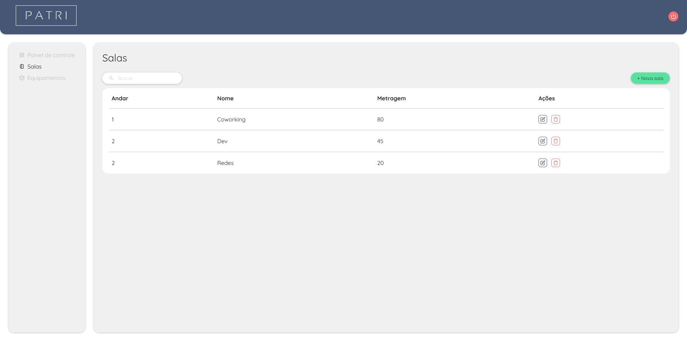
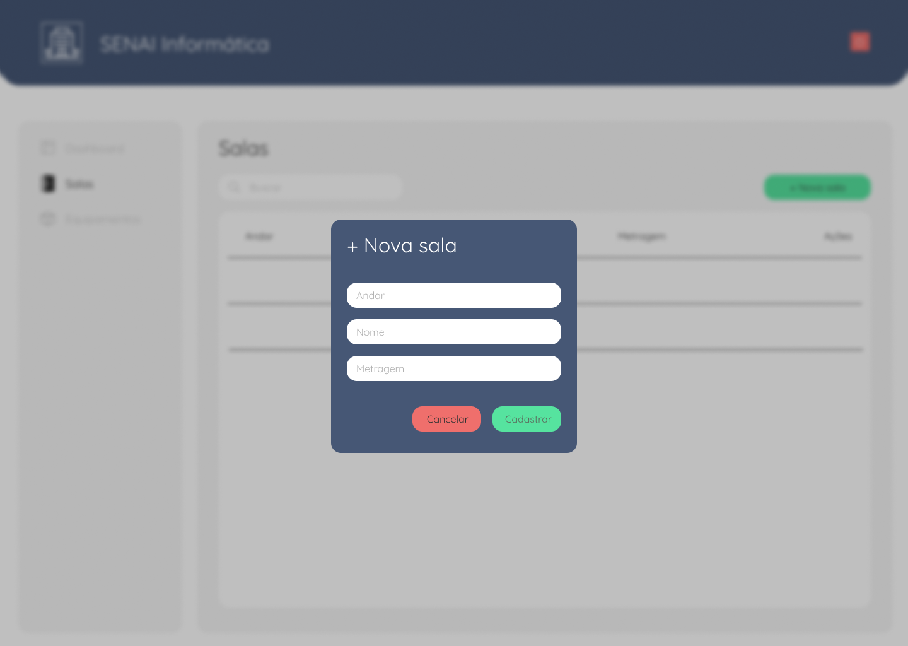
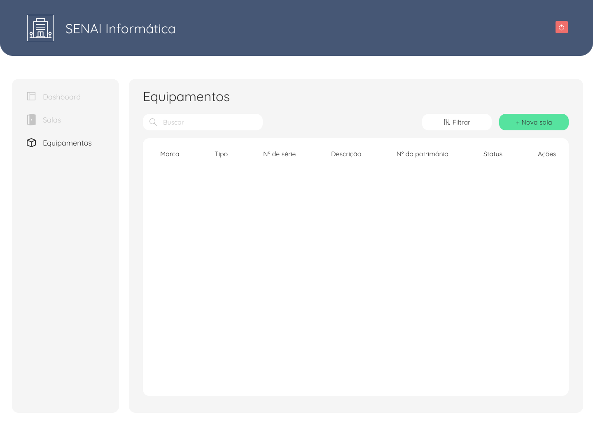
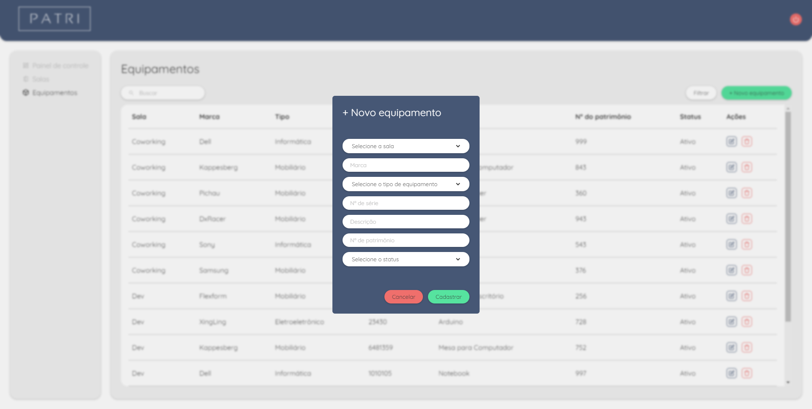

<h1 align="center">
  
</h1>
 
 

  

 

## Sobre o projeto 💬

O **Patri** é uma aplicação web com o intuito de facilitar o gerenciamento do patrimônio de sua empresa, organizando por salas e equipamentos. Os dados são armazenados em um banco de dados, podem ser acessados e alterados pela API que por sua vez é consumida pela UI que exibe para o usuário as informações

Para desenvolver esta aplicação foi utilizado metodologias ágeis Scrum e Kanban, facilitando a organização, designação de tarefas e definição de prazos de entrega.

Os desenvolvedores que participaram deste projeto, foram: _[Vinícius Figueiroa](https://github.com/mateusrodsilva)_, _[Mateus Rodrigues](https://github.com/mateusrodsilva)_, _[Renato Alves](https://github.com/renatoalvesdv)_, e _[Pedro Felipe](https://github.com/pedro)_

<!-- Ao logar na aplicação com nosso username do GitHub vamos para a página home, nela vemos nossos amigos (seguidores do GitHub), as comunidades que participamos, e os últimos recados deixados. Além disso é possível criar novas comunidades e novos recados! -->

## Páginas 🔖

- [Login](#página-de-login)
- [Cadastro](#página-de-cadastro)
- [Dashboard](#dashboard)
- [Salas](#salas)
- [Equipamentos](#equipamentos)

## Funcionalidades 🧠

A aplicação contém as seguintes funcionalidades:

### Login

- Fazer login na aplicação.

  

### Cadastro

- Cadastrar uma nova instituição.

  

### Dashboard

- Ver a quantidade de salas cadastradas;
- Ver a quantidade de equipamentos cadastrados.

  

### Salas

- Ver todas as salas;
- Cadastrar uma nova sala;
- Atualizar uma sala;
- Remover uma sala.

  

  

### Equipamentos

- Ver todos os equipamentos;
- Cadastrar um novo equipamento;
- Atualizar um equipamento;
- Remover um equipamento.

  

  

## Como utilizar? 📌

Para utilizar a aplicação em sua máquina é necessário ter os seguintes softwares instalados:

- [Node.js](https://nodejs.org/pt-br/)
- [.NET 5.0](https://dotnet.microsoft.com/download)
- [SQL Server](https://www.microsoft.com/pt-br/sql-server/sql-server-downloads?rtc=1)
- [SQL Server Management Studio (SSMS)](https://docs.microsoft.com/pt-br/sql/ssms/download-sql-server-management-studio-ssms?view=sql-server-ver15)

Com os software citados acima instalados, basta seguir os seguintes passos para executar a aplicação em sua máquina:

1. **Clonar o projeto**  
   Abra o terminal em uma pasta de sua preferência e cole o seguinte código: _`git clone https://github.com/vinixiii/WishList`_

2. **Criar o banco de dados**  
   No SSMS do SQL Server execute os scripts que estão em _`WishList\db`_

3. **Configurar o acesso ao banco de dados na API**  
   No caminho _`WishList\back-end\Senai_WishList\Senai_WishList\Contexts`_ abra o arquivo _`WishlistContext.cs`_ no editor de texto de sua prefêrencia e altere na _`linha 29`_ a string de conexão do banco de dados de acordo com suas credenciais de acesso

4. **Instalar as dependências**  
   Abra o terminal no caminho _`WishList\front-end\senai_wishlist-ui`_ e digite _`npm install`_

5. **Executar a API**  
   Abra o terminal no caminho _`WishList\back-end\Senai_WishList\Senai_WishList`_ e digite _`dotnet run`_

6. **Executar a UI**  
   Abra o terminal no caminho _`WishList\front-end\senai_wishlist-ui`_ e digite _`npm start`_

## Tecnologias 🛠

Desenvolvido utilizando as seguintes tecnologias:

- [SQL Server](https://docs.microsoft.com/pt-br/sql/?view=sql-server-ver15)
- [C#](https://docs.microsoft.com/pt-br/dotnet/csharp/)
- [Entity Framework Core](https://docs.microsoft.com/pt-br/ef/)
- [ASP.NET Core](https://docs.microsoft.com/pt-br/aspnet/core/?view=aspnetcore-5.0)
- [React](https://reactjs.org)
- [Next.js](https://nextjs.org/)
- [styled-components](https://styled-components.com/)

---

Feito com ❤ por: Vinícius Figueiroa 🙋🏻‍♂️

